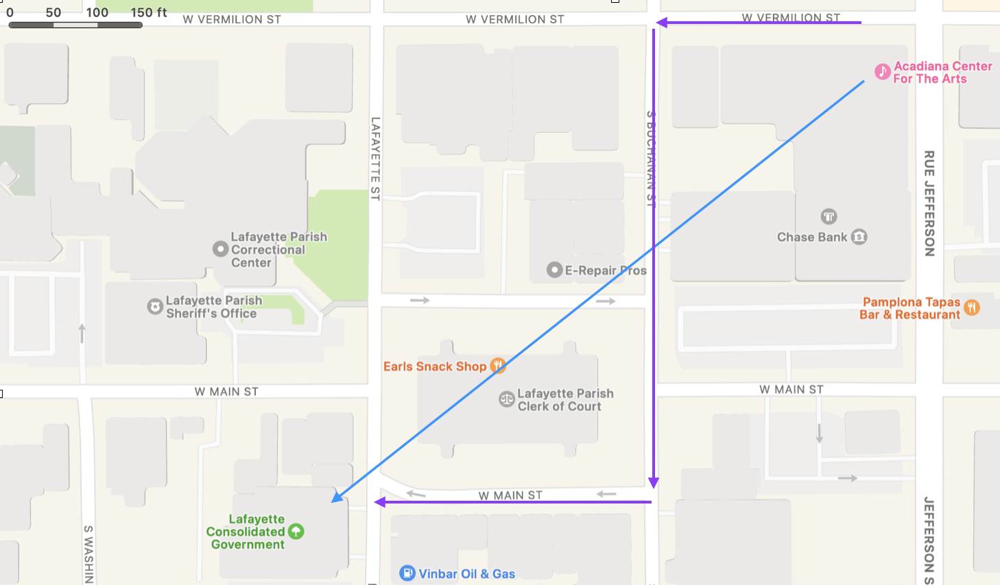

## 1-9 Vector Space Models

In this first unit we began by exploring one text and then added a handful of other texts that were similar in size and nature. Our first point of comparison was lexical diversity, something we could easily calculate within a text by dividing the total number of unique words by the overall number of words, or length, of the text. Our second point of comparison was a quick look at a topic model. In both our comparisons, we ignored the sequence of the words within a text, rendering it what is commonly known as a "bag of words."

Bag of words is an amusing image, unless of course you are a writer or literature instructor, but it isn’t itself an accurate representation of the underlying data. It is a bag of words and their counts. Word clouds are probably a better representation: when you create a word cloud you do not make all the words the same size; the words that appear more often are larger than those that do not. Given that the most frequent words in many texts are not central to the meaning of the text (but central to the sentences that deliver that meaning), one of the first things you learn to do with a word cloud, or which gets done behind the scenes in the software, is remove those *function* words from consideration, leaving mostly the words that carry meaning.

A word cloud is built on a collection of word-count pairs such that every word is represented as both itself and the number of times it occurs in a text. When we wanted to compare texts, we built a document-term matrix (DTM), which is simply a table in which our texts appear as rows and the words appear as columns. (The word order does not matter and can be the order in which words are entered or alphabetically or numerically or any other way the analyst finds useful or interesting.)

> **Note**: The arrangement of documents as rows and words as columns in a DTM is conventional because it follows a larger scientific convention of observations being listed as rows and features being listed as columns. Thus, if you look at U.S. Census data you will see a household as a line and then various aspects or dimensions of that household — income, number of members, value of home — unfolding across the row in columns. As we will see later, columns need not contain data of all the same type: while a DTM is all numbers (integers), most data stores contain a mix of counts, text, categories, dates to name just a few options. Not all data is stored in this observation x features manner, so it’s always good to double-check before you proceed. (Biostatistics, for example, often structures data as features x observations.)

### Vector Spaces

When we render a collection of texts into a series of rows and columns, we have turned them into vectors. All of us have encountered two-dimensional vectors. Every time we pull out a map, or pull up a map app on our phones, we are looking at a two-dimensional representation of our three-dimensional reality, a representation so effective that humans have been using them for millennia: the earliest surviving maps include cave paintings and etchings on tusk and stone. (We also have examples of detailed maps from ancient Babylon, Greece and Rome, China, and India.)

If we stay with our phone map app for a second, we can recognize the utility of vectors and, in fact, how all of us benefit from vector addition almost every day. Imagine that it is a nice spring night and you have just taken in a show at the Acadiana Center for the Arts. You come out and remember that the closest parking was actually at the LCG building. You pull out your phone, and, while you can see that “as the crow flies” it is about 800 feet, there’s no way you can fly like a crow. That vector is not available to you.

Instead, you come as close as you can, using three vectors which added together are the same as the original vector. Every day you engage in vector addition as you wind your way across campus, navigating around and through buildings in order to get to class on time. (Or not, in some cases.)

Coordinate systems are reliable and give us reproducible results: geometry, the mathematical study of points in space, offers us established ways to explore relations, similarities, and differences between those points. The only difference between our map example and the average DTM is the number of dimensions: the move from two, or three, dimensions to *N* dimensions is to move from something easily visualized to something not. 

### Dimensionality & Distances

The *N* is difficult. Falling back on analogies of squares to cubes and then cubes to tesseracts hardly seems useful when someone tells you that a DTM has several thousand dimensions. The good news here is that N-dimensional spaces are just like three-dimensional spaces: all the geometry still works. A lot of the work we do in analytics in general and text analytics in particular is to find ways to reduce the dimensionality, which often unlocks patterns we would not have otherwise discerned.
